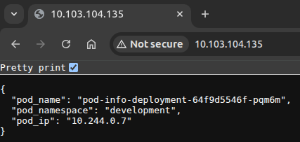
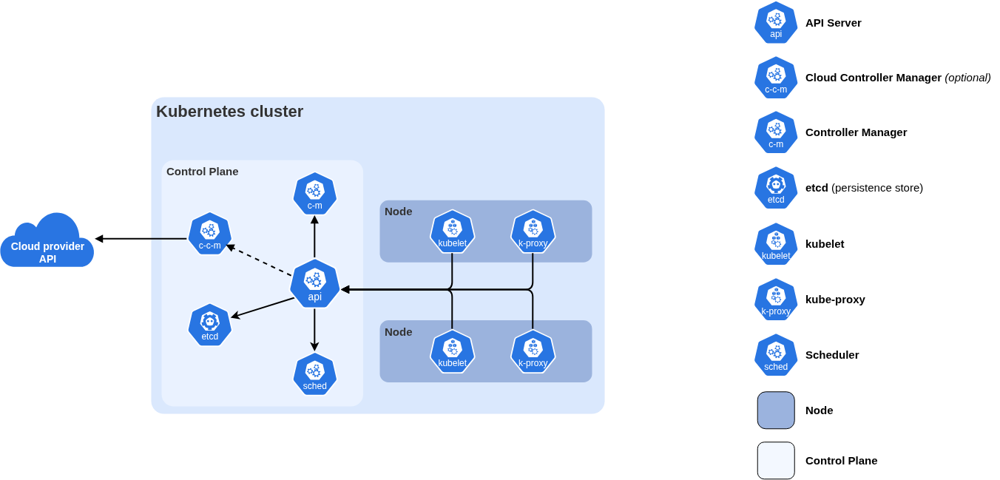

# Orchestration &mdash; K8S

- This repository contains concepts and tools related to Kubernetes (K8S).
- The exercises are sourced from [LinkedIn Learning's Course &mdash; Learning Kubernetes by *Kim Schlesinger*](https://github.com/LinkedInLearning/learning-kubernetes-3212391/tree/main)

## Challenges

> The challenges are to be done after the content above it understood and practiced.

1. [Challenge 1: Create Your Own Deployment](#challenge-1-create-your-own-deployment)

## Table of Contents

- [Orchestration — K8S](#orchestration--k8s)
  - [Challenges](#challenges)
  - [Table of Contents](#table-of-contents)
  - [Get Started](#get-started)
  - [Spin-Up Clusters \& Interact With Them](#spin-up-clusters--interact-with-them)
  - [Create a Namepsace](#create-a-namepsace)
    - [Example Namespace](#example-namespace)
  - [Deploying An Application](#deploying-an-application)
    - [Creating Pods Using an Existing YAML Spec](#creating-pods-using-an-existing-yaml-spec)
    - [Check Health Using Event Logs](#check-health-using-event-logs)
    - [Application/Pod Verification Using `BusyBox`](#applicationpod-verification-using-busybox)
    - [Application/Pod Verification Using Application Logs](#applicationpod-verification-using-application-logs)
  - [Challenge 1: Create Your Own Deployment](#challenge-1-create-your-own-deployment)
  - [Complex Application Deployment](#complex-application-deployment)
    - [Kubernetes Service — Explosing App to Internet w/ Load Balancer](#kubernetes-service--explosing-app-to-internet-w-load-balancer)
    - [Add Resource Requests \& Limits To Your Pods](#add-resource-requests--limits-to-your-pods)
    - [Delete Kuberenetes Objects \& Tear Down Your Cluster](#delete-kuberenetes-objects--tear-down-your-cluster)
      - [Deleting the `minikube` Cluster](#deleting-the-minikube-cluster)
  - [Kubernetes Architecture 🔥🔥](#kubernetes-architecture-)
    - [Kubernetes Control Plane 🔥](#kubernetes-control-plane-)
    - [Kubernetes Worker Nodes 🔥](#kubernetes-worker-nodes-)
      - [Components in Worker Nodes](#components-in-worker-nodes)
    - [How the Control Plane \& Nodes Work Together](#how-the-control-plane--nodes-work-together)
      - [Glossary of Kubernetes Cluster Components](#glossary-of-kubernetes-cluster-components)
  - [Advanced Topics](#advanced-topics)
    - [Ways to Manage Kubernetes Pods](#ways-to-manage-kubernetes-pods)
    - [Running Stateful Workloads](#running-stateful-workloads)

## Get Started

- Install [`minikube`](https://minikube.sigs.k8s.io/docs/start/) &mdash; the page should load and show the correct command to download, based on which OS you've opened the page on.

## Spin-Up Clusters & Interact With Them

> ***Notes***:
>
> 1. `minikube` is used to create a cluster. Different cloud providers will have different commands for spinning-up/creating a cluster. `minikube` is a FOSS version of the cloud providers that isn't suitable for large-scale production enviornments, but works well for learning, and setting up applications at the smaller level for learning and experimentation.
> 2. `kubectl` is used to interact with a cluster once the cluster has been spun-up. This command is universal, and works even in a cloud provider host to interact with the cluster.

- Start the cluster using:

  ```sh
  # This would be different for different cloud providers
  minikube start
  ```

  You should see something as follows:

  ```terminal
  😄  minikube v1.38.1 on Ubuntu 22.04
  ✨  Automatically selected the docker driver. Other choices: ssh, none
  ❗  Starting v1.39.0, minikube will default to "containerd" container runtime. See #21973 for more info.
  📌  Using Docker driver with root privileges
  👍  Starting "minikube" primary control-plane node in "minikube" cluster
  🚜  Pulling base image v0.0.50 ...
  💾  Downloading Kubernetes v1.35.1 preload ...
      > preloaded-images-k8s-v18-v1...:  272.45 MiB / 272.45 MiB  100.00% 12.63 M^[[D
      > gcr.io/k8s-minikube/kicbase...:  519.58 MiB / 519.58 MiB  100.00% 15.81 M
  🔥  Creating docker container (CPUs=2, Memory=15900MB) ...
  🐳  Preparing Kubernetes v1.35.1 on Docker 29.2.1 ...
  🔗  Configuring bridge CNI (Container Networking Interface) ...
  🔎  Verifying Kubernetes components...
      ▪ Using image gcr.io/k8s-minikube/storage-provisioner:v5
  🌟  Enabled addons: storage-provisioner, default-storageclass
  💡  kubectl not found. If you need it, try: 'minikube kubectl -- get pods -A'
  🏄  Done! kubectl is now configured to use "minikube" cluster and "default" namespace by default
  ```

- You can get cluster information using:

  ```sh
  kubectl cluster-info
  ```

  And you should see something like the following:

  ```terminal
  Kubernetes control plane is running at https://192.168.49.2:8443
  CoreDNS is running at https://192.168.49.2:8443/api/v1/namespaces/kube-system/services/kube-dns:dns/proxy

  To further debug and diagnose cluster problems, use 'kubectl cluster-info dump'.
  ```

- Once your cluster's ready, check the nodes running on the cluser using the following command:

  ```sh
  # Command should work everywhere unless `kubectl` isn't installed
  kubectl get nodes

  # if `kubectl` is not installed, use the same command in `minikube`'s context
  minikube kubectl -- get nodes
  ```

  You should see something like the following:

  ```terminal
  NAME       STATUS   ROLES           AGE   VERSION
  minikube   Ready    control-plane   21m   v1.35.1
  ```

- To look at the namespaces that get created by default:

  ```sh
  kubectl get namespaces
  ```

  By default, you should be seeing the following namespaces in your system [not necessarily the same ones, but some output should exist!]:

  ```terminal
  NAME              STATUS   AGE
  default           Active   22m
  kube-node-lease   Active   22m
  kube-public       Active   22m
  kube-system       Active   22m
  ```

  > ***NOTE***: `namespaces` are way to isolate and manage applications & services that you want to remain separate.

- To look at the pods that are installed, when you spin-up a minikube cluster:

  ```sh
  kubectl get pods -A # -A: list pods in all namespaces
  ```

  Output should be something like this:

  ```terminal
  NAMESPACE     NAME                               READY   STATUS    RESTARTS      AGE
  kube-system   coredns-7d764666f9-58mp6           1/1     Running   0             26m
  kube-system   etcd-minikube                      1/1     Running   0             26m
  kube-system   kube-apiserver-minikube            1/1     Running   0             26m
  kube-system   kube-controller-manager-minikube   1/1     Running   0             26m
  kube-system   kube-proxy-ssgpq                   1/1     Running   0             26m
  kube-system   kube-scheduler-minikube            1/1     Running   0             26m
  kube-system   storage-provisioner                1/1     Running   1 (25m ago)   26m
  ```

- To look at the services that are installed, when you spin-up a minikube cluster:

  ```sh
  kubectl get services -A # -A: list services in all namespaces
  ```

  Output should look something like:

  ```terminal
  NAMESPACE     NAME         TYPE        CLUSTER-IP   EXTERNAL-IP   PORT(S)                  AGE
  default       kubernetes   ClusterIP   10.96.0.1    <none>        443/TCP                  29m
  kube-system   kube-dns     ClusterIP   10.96.0.10   <none>        53/UDP,53/TCP,9153/TCP   29m
  ```

  > ***NOTE***: `services` act as node balances within a cluster and they direct traffic to `pods`.

[Go 🆙](#table-of-contents)

## Create a Namepsace

- Kubernetes `namespace`s lets you isolate organize your workloads.
  - Ex: If you've different environments for your application and services, you can organize the different environments of your application using namespaces like `"dev"` [for development] and `"prod"` [for production].

### Example Namespace

- The following yaml is available at [`nameppace.yml`](./Ex_Files_Learning_Kubernetes/Exercise_Files/03_02_Begin/namespace.yaml)

  ```yml
  ---
  apiVersion: v1
  kind: Namespace
  metadata:
    name: development # this is what's important; this namespace is called `development`
  ```

- To create a namespace from the aforementioned file, you run `kubectl` as:

  ```sh
  kubectl apply -f /path/to/namespace.yaml
  ```

  You should see something like this:

  > ```terminal
  > namespace/development created
  > ```

- Then check the created namespace using:

  ```sh
  kubectl get namespaces
  ```

  > You should something as follows:
  >
  > ```terminal
  > NAME              STATUS   AGE
  > default           Active   26h
  > development       Active   2s        <----  NEWLY CREATED
  > kube-node-lease   Active   26h
  > kube-public       Active   26h
  > kube-system       Active   26h
  > ```

- Because kubernetes manifests are written in YAML, it's possible to define multiple resources in one file by separating them with 3 horizontal dashes `-` as follows:

  ```yml
  ---
  apiVersion: v1
  kind: Namespace
  metadata:
    name: development # this is what's important; this namespace is called `development`
  ---         # <--- signifies a new resource definition in k8s
  apiVersion: v1
  kind: Namespace
  metadata:
    name: production # this is what's important; this namespace is called `production`
  ```

  > As can be seen here, there are 2 namepsaces defined here in the same manifest because YAML allows this by using the 3 horizontal dashes `---`.

- Run the apply command again:

  ```sh
  kubectl apply -f /path/to/namespace.yaml
  ```

  You should see something like this:

  > ```terminal
  > namespace/development unchanged
  > namespace/production created
  > ```

  Get the namespaces:

  ```sh
  kubectl get namespaces
  ```

  You should see the following:

  > ```terminal
  > NAME              STATUS   AGE
  > default           Active   27h
  > development       Active   45m
  > kube-node-lease   Active   27h
  > kube-public       Active   27h
  > kube-system       Active   27h
  > production        Active   118s
  > ```

- To ***delete*** the namespaces that were just created, use the following command:

  ```sh
  kubectl delete -f /path/to/namespace.yaml
  ```

  You should see the following:

  > ```terminal
  > namespace "development" deleted
  > namespace "production" deleted
  > ```

[Go 🆙](#table-of-contents)

## Deploying An Application

- K8S is designed to make your applications highly available, meaning that there are multiple replicas of your application running at the same time, so that if one stops working, there are at least two others accepting traffic.
- `Pods` are the k8s resource that run our applications and microservices, and one way to ensure that an application is highly available, is to organize your pods using a kubernetes deployment.

### Creating Pods Using an Existing YAML Spec

- You can find the following YAML spec in [`deployment.yaml`](./Ex_Files_Learning_Kubernetes/Exercise_Files/03_03/deployment.yaml)

  ```yml
  ---
  apiVersion: apps/v1         # API group to which the requests are being sent to
  kind: Deployment            # Kind of k8s object we want to create, which is "Deployment" object.
  metadata:
    name: pod-info-deployment # Name given to the deployment
    namespace: development    # Namespace where the pods will be created at
    labels:
      app: pod-info           # Labelling all the pods in this group, with the app name as `pod-info`
  spec:
    replicas: 3               # How many replicas of the container we want to run is specified here
    selector:
      matchLabels:
        app: pod-info
    template:
      metadata:
        labels:
          app: pod-info
      spec:
        containers:
          - name: pod-info-container
            image: kimschles/pod-info-app:latest    # Pulls the latest version of `pod-info-app`, and then directs traffic to port 3000
            ports:
              - ctonainerPort: 3000
            env:
              - name: POD_NAME
                valueFrom:
                  fieldRef:
                    fieldPath: metadata.name
              - name: POD_NAME
                valueFrom:
                  fieldRef:
                    fieldPath: metadata.namespace
              - name: POD_NAME
                valueFrom:
                  fieldRef:
                    fieldPath: status.podIP
  ```

- Before creating the deployment, let's make sure that we've the `development` namespace:

  ```sh
  kubectl get ns # same as: kubectl get namespaces
  ```

- Create the `development` namespace using [`nameppace.yml`](./Ex_Files_Learning_Kubernetes/Exercise_Files/03_02_Begin/namespace.yaml):

  ```sh
  kubectl apply -f /path/to/namespace.yaml
  ```

  You should see something like this:

  > ```terminal
  > namespace/development created
  > ```

- To run the deployment, simply do as follows:

  ```sh
  kubectl apply -f /path/deployment.yaml
  ```

  You should see something like:

  > ```terminal
  > deployment.apps/pod-info-deployment created
  > ```

- To confirm, list all the containers deployed in the `development` namespace:

  ```sh
  kubectl get deployments -n development        # -n: namespace
  ```

  Output should be:

  > ```terminal
  > NAME                  READY   UP-TO-DATE   AVAILABLE   AGE
  > pod-info-deployment   3/3     3            3           91s
  > ```

- To check the pods created by the deployment, run:

  ```sh
  kubectl get pods -n development               # -n: namespace
  ```

  Output should be something like:

  > ```terminal
  > NAME                                   READY   STATUS              RESTARTS   AGE
  > pod-info-deployment-64f9d5546f-6rqsw   0/1     ContainerCreating   0          5s
  > pod-info-deployment-64f9d5546f-7n8ks   0/1     ContainerCreating   0          5s
  > pod-info-deployment-64f9d5546f-dp6lf   1/1     Running             0          5s
  > ```
  >
  > There exactly 3 pods! (as `replicas: 3` in [`development.yaml`](./Ex_Files_Learning_Kubernetes/Exercise_Files/03_03/deployment.yaml#L10) manifest)

- When it's configured to be `3` replicas, there will always be those 3 replicas of the same application, and that can be shown using:

  ```sh
  # syntax: kubcetl delete pod <pod-name> -n <namespace>
  kubectl delete pod pod-info-deployment-64f9d5546f-6rqsw -n development
  ```

  O/P:

  ```terminal
  pod "pod-info-deployment-64f9d5546f-6rqsw" deleted from development namespace
  ```

  Now, if we list the pods in `development` namespace, there would be 3 pods for sure:

  ```sh
  kubectl get pods -n development
  ```

  O/P:

  ```terminal
  NAME                                   READY   STATUS    RESTARTS   AGE
  pod-info-deployment-64f9d5546f-7n8ks   1/1     Running   0          9m49s
  pod-info-deployment-64f9d5546f-dp6lf   1/1     Running   0          9m49s
  pod-info-deployment-64f9d5546f-pqm6m   1/1     Running   0          2m9s
  ```
  
  > As you can see! there are no pods that were destroyed, but a new one got spun-up in no time.

[Go 🆙](#table-of-contents)

### Check Health Using Event Logs

- K8S saves the event log when a new pod is created during a deployment, so that anyone can troubleshoot the pod in case of a failure.
- Get the pod whose event log you'd like to view:

  ```sh
  kubectl get pods -n development
  ```

  Output can be like this:

  > ```terminal
  > NAME                                   READY   STATUS    RESTARTS   AGE
  > pod-info-deployment-64f9d5546f-7n8ks   1/1     Running   0          19m
  > pod-info-deployment-64f9d5546f-dp6lf   1/1     Running   0          19m
  > pod-info-deployment-64f9d5546f-pqm6m   1/1     Running   0          11m
  > ```

  We can copy any pod's name we want, and check its event log.

- To check the event log of a pod, use:

  ```sh
  kubectl describe pod pod-info-deployment-64f9d5546f-7n8ks -n development
  ```

  You should see something like the following:

  ```terminal
  Name:             pod-info-deployment-64f9d5546f-7n8ks
  Namespace:        development
  Priority:         0
  Service Account:  default
  Node:             minikube/192.168.49.2
  Start Time:       Tue, 24 Mar 2026 20:14:11 +0530
  Labels:           app=pod-info
                    pod-template-hash=64f9d5546f
  Annotations:      <none>
  Status:           Running
  IP:               10.244.0.5
  IPs:
    IP:           10.244.0.5
  Controlled By:  ReplicaSet/pod-info-deployment-64f9d5546f
  Containers:
    pod-info-container:
      Container ID:   docker://1493115e2664fd5d62fc19119d9a35935bf9512d54f64b68c772e7b0fa610efb
      Image:          kimschles/pod-info-app:latest
      Image ID:       docker-pullable://kimschles/pod-info-app@sha256:fa4f33bc2301bb242bdd078ac206d0e379dfed2e225d46a6952ff444ae6f4a7a
      Port:           3000/TCP
      Host Port:      0/TCP
      State:          Running
        Started:      Tue, 24 Mar 2026 20:14:16 +0530
      Ready:          True
      Restart Count:  0
      Environment:
        POD_NAME:       pod-info-deployment-64f9d5546f-7n8ks (v1:metadata.name)
        POD_NAMESPACE:  development (v1:metadata.namespace)
        POD_IP:          (v1:status.podIP)
      Mounts:
        /var/run/secrets/kubernetes.io/serviceaccount from kube-api-access-94qf7 (ro)
  Conditions:
    Type                        Status
    PodReadyToStartContainers   True 
    Initialized                 True 
    Ready                       True 
    ContainersReady             True 
    PodScheduled                True 
  Volumes:
    kube-api-access-94qf7:
      Type:                    Projected (a volume that contains injected data from multiple sources)
      TokenExpirationSeconds:  3607
      ConfigMapName:           kube-root-ca.crt
      Optional:                false
      DownwardAPI:             true
  QoS Class:                   BestEffort
  Node-Selectors:              <none>
  Tolerations:                 node.kubernetes.io/not-ready:NoExecute op=Exists for 300s
                              node.kubernetes.io/unreachable:NoExecute op=Exists for 300s
  Events:
    Type    Reason     Age   From               Message
    ----    ------     ----  ----               -------
    Normal  Scheduled  21m   default-scheduler  Successfully assigned development/pod-info-deployment-64f9d5546f-7n8ks to minikube
    Normal  Pulling    21m   kubelet            spec.containers{pod-info-container}: Pulling image "kimschles/pod-info-app:latest"
    Normal  Pulled     21m   kubelet            spec.containers{pod-info-container}: Successfully pulled image "kimschles/pod-info-app:latest" in 2.338s (4.873s including waiting). Image size: 213980203 bytes.
    Normal  Created    21m   kubelet            spec.containers{pod-info-container}: Container created
    Normal  Started    21m   kubelet            spec.containers{pod-info-container}: Container started
  ```

  > There are no issues with the pod, but, most issues of the pod during the first few minutes of the deployment.

[Go 🆙](#table-of-contents)

### Application/Pod Verification Using `BusyBox`

- Once you deploy, you might want to verify that the application is working as expected.
- One way to verify and check, is to use a tool called **BusyBox** [contains many utilities like `awk`, `wget`, `date`, `whoami`, etc]. It's a great tool for debugging, and troubleshooting applications on a linux environment, and k8s runs on linux.
- Since we just want to debug and verify our application's working, we can just use our default namespace, and create only 1 replica of the `BusyBox` pod, from the file in [`busybox.yaml`](./Ex_Files_Learning_Kubernetes/Exercise_Files/03_05/busybox.yaml).

  ```yml
  ---
  apiVersion: apps/v1
  kind: Deployment
  metadata:
    name: busybox
    namespace: default
    labels:
      app: busybox
  spec:
    replicas: 1
    selector:
      matchLabels:
        app: busybox
    template:
      metadata:
        labels:
          app: busybox
      spec:
        containers:
          - name: busybox-container
            image: busybox:latest
            command: ['/bin/sh', '-c', '--'] # This keeps the container running, otherwise, the container will start and terminate
            args: ['while true; do sleep 30; done']
            resources:
              requests:
                cpu: 30m
                memory: 60Mi
              limits:
                cpu: 100m
                memory: 128Mi
  ```

  ```sh
  kubectl apply -f /path/to/busybox.yaml
  ```

  Check whether the container was created or not:

  ```sh
  kubectl get pods
  ```

  O/P should be:

  ```terminal
  NAME                       READY   STATUS              RESTARTS   AGE
  busybox-65c9d65546-wzvqj   0/1     ContainerCreating   0          6s
  ```

  > Remember, whenever you use the command `kubectl get pods`, it always gets the pods running in `default` namespace.
  > To explicitly get the pods running in a namespace, you've to use the command - `kubectl get pods -n <namespace-name>`

- Now get the pods running in `development` namespace using the `wide` option to show extra information like IP addresses, restarts, node, etc:

  ```sh
  kubectl get pods -n development -o wide
  ```

  O/P:

  ```terminal
  NAME                                   READY   STATUS    RESTARTS   AGE   IP           NODE       NOMINATED NODE   READINESS GATES
  pod-info-deployment-64f9d5546f-7n8ks   1/1     Running   0          24h   10.244.0.5   minikube   <none>           <none>
  pod-info-deployment-64f9d5546f-dp6lf   1/1     Running   0          24h   10.244.0.4   minikube   <none>           <none>
  pod-info-deployment-64f9d5546f-pqm6m   1/1     Running   0          24h   10.244.0.7   minikube   <none>           <none>
  ```

- Login to the busybox pod using the following `exec` command [similar to how we login to a container using `docker`]:

  ```sh
  kubectl exec -it busybox-65c9d65546-wzvqj -- /bin/sh
  ```

  You should be able to see a new shell prompt as follows:

  ```terminal
  / #
  ```

  > You're successfully logged into busybox pod.

- In the busybox pod, try and `wget` on one of the IPs for the pods in `development` namespace as follows:

  ```terminal
  / # wget 10.244.0.5
  ```

  You should see something like the following:

  ```terminal
  / # wget 10.244.0.5
  Connecting to 10.244.0.5 (10.244.0.5:80)
  wget: can't connect to remote host (10.244.0.5): Connection refused
  / #
  ```

  That's because the app is originally deployed on port `3000`, as mentioned in [`deployment.yamlL23`](./Ex_Files_Learning_Kubernetes/Exercise_Files/03_03/deployment.yamlL23).

- Now if you try to use `wget` for the same IP, on port `3000`, as follows:

  ```terminal
  / # wget 10.244.0.5:3000
  ```

  O/P should be the following:

  ```terminal
  / # wget 10.244.0.5:3000
  Connecting to 10.244.0.5:3000 (10.244.0.5:3000)
  saving to 'index.html'
  index.html           100% |*********************************************************************************************************************************|   103  0:00:00 ETA
  'index.html' saved
  ```

  > `wget` saved a file called `index.html` in the same directory.
  > To look into the file, you can run `cat index.html`. It just returns the pod name, namespace, and IP like: `{"pod_name":"pod-info-deployment-64f9d5546f-7n8ks","pod_namespace":"development","pod_ip":"10.244.0.5"}`.

[Go 🆙](#table-of-contents)

### Application/Pod Verification Using Application Logs

- We can also check whether the application is working or not, using application logs.
- To do so, we need to use the following command [but first, get the name of the pod whose logs you'd like to inspect using `kubectl get pods -n <namespace-name>`]:

  ```sh
  kubectl logs pod-info-deployment-64f9d5546f-7n8ks -n development
  ```

  O/P should be:

  ```terminal
  undefined
  Example app listening on port 3000
  ```

[Go 🆙](#table-of-contents)

## Challenge 1: Create Your Own Deployment

1. Create a new deployment in a file called `quote.yaml`
2. Name the deployment and name the app label `quote-service`
3. Use the `development` namespace
4. Name the container `quote-container`
5. Run `2` replicas
6. Use the image `datawire/quote:0.5.0`
7. Set the container to accept traffic at port `8080`
8. Create the pods using `kubectl apply -f quote.yml`
9. [OPTIONAL] Use `BusyBox` to test that the application can accept traffic from inside the cluster

> Solution [along with an explanation] can be found at [`challenge-solutions/challenge-1__create-your-own-deployment/`](challenge-solutions/challenge-1__create-your-own-deployment/).

[Go 🆙](#table-of-contents)

## Complex Application Deployment

- In this section, you'll learn about:
  1. What's a Kubernetes Service.
  2. How to manage resources and set limits for your pods.
  3. Deleting the created pods and clusters.

### Kubernetes Service &mdash; Explosing App to Internet w/ Load Balancer

- Up until this point, whichever app we've deployed, has only been accessible from inside the busybox pod/container. But how do you expose your app to the internet?
- Using a **Kubernetes Service**: It's a load balancer that connects the internet to the k8s pods. A load balancer service has a public and a static IP address. Public IP => anyone on the internet can access it; and the static IP is important, because your pods and their IP addresses change frequently (because of pod tear down due to auto-scaling), but your service IP needs to remain the same.
- Taking a look at a YAML manifest for a service (can be found also at [`service.yaml`](./Ex_Files_Learning_Kubernetes/Exercise_Files/04_01/service.yaml)):

  ```yml
  ---
  apiVersion: v1
  kind: Service
  metadata:
    name: demo-service
    namespace: development
  spec:
    selector:
      app: pod-info         # This label must be used for all the apps that want to make use of this service. See `deployment.yaml` at https://github.com/Ch-sriram/orchestration-k8s/blob/00788cd5cbc6cbf5a3fdead1c8900b8cdc680008/Ex_Files_Learning_Kubernetes/Exercise_Files/03_03/deployment.yaml#L8.
    ports:
      - port: 80            # Accept traffic from anyone on the internet, only on port 80.
        targetPort: 3000    # Re-route all traffic from port 80, to port 3000 locally, in the cluster pods, that make use of `pod-info` label.
    type: LoadBalanacer     # 1 of 3 types of Kubernetes Services: The other 2 are NodePort and ClusterIP
  ```

- To create the service, run the following command in a new terminal:

  ```sh
  minikube tunnel
  ```

  O/P should be the following:

  ```terminal
  user@host ~ $ minikube tunnel
  [sudo] password for user@host: 
  Status:
          machine: minikube
          pid: 91336
          route: 10.96.0.0/12 -> 192.168.49.2
          minikube: Running
          services: []
      errors: 
                  minikube: no errors
                  router: no errors
                  loadbalancer emulator: no errors
  ```

- Now, in a new tab, apply the YAML manifest in [`service.yaml`](./Ex_Files_Learning_Kubernetes/Exercise_Files/04_01/service.yaml), as follows:

  ```sh
  kubectl apply -f /path/to/service.yaml
  ```

  O/P:

  > ```terminal
  > service/demo-service created
  > ```

- You can check your created service in the *development* namespace as follows:

  ```sh
  kubectl get services -n development
  ```

  O/P:

  > ```terminal
  > user@host:~ $ kubectl get services -n development
  > NAME           TYPE           CLUSTER-IP       EXTERNAL-IP      PORT(S)        AGE
  > demo-service   LoadBalancer   10.103.104.135   10.103.104.135   80:32357/TCP   33s
  > ```
  >
  > NOTE: You can see 2 IPs, one for internal IP, inside the cluster, and the other one is the External IP. In some situations, the External IP may just be the loopback address - `127.0.0.1`, because minikube cluster is a local cluster that runs only in our own computers, and hence, there's no one to access it from the outside. If you ever create a service inside GCP, AWS, or Azure, the External IP is actually an IP, that can be accessed via the Internet.

- Now open a browser, and type-in [or paste] the External IP address of `demo-service`, and you should see the JSON object from the application as follows:

  

[Go 🆙](#table-of-contents)

### Add Resource Requests & Limits To Your Pods

- Resources refer to the amount of available cpu and memory on the worker node running your pods.
- If you deploy a pod without set of resource requests, it can be scheduled on a node, that does NOT have a lot of processing power (cpu) or memory, and might cause the node to fail.
- Similarly, if you do NOT set resource limits, then you start a pod on a node, and your application starts using more and more cpu and memory, which leads to all resources of your node to be used by the application, causing the node to fail, and failed nodes cause outages, which we want to avoid!
- Let's add resource request and limits to our `pod-info` container [which can also be found in [`deployment.yaml#L23-L28`](./Ex_Files_Learning_Kubernetes/Exercise_Files/04_02_End/deployment.yaml#L22)]:

  ```diff
  diff --git a/Ex_Files_Learning_Kubernetes/Exercise_Files/03_03/deployment.yaml b/Ex_Files_Learning_Kubernetes/Exercise_Files/03_03/deployment.yaml
  index c5a42a2..7d2d88b 100755
  --- a/Ex_Files_Learning_Kubernetes/Exercise_Files/03_03/deployment.yaml
  +++ b/Ex_Files_Learning_Kubernetes/Exercise_Files/03_03/deployment.yaml
  @@ -19,6 +19,13 @@ spec:
        containers:
        - name: pod-info-container
          image: kimschles/pod-info-app:latest
  +        resources:
  +          requests:
  +            memory: "64Mi"
  +            cpu: "250m"
  +          limits:
  +            memory: "128Mi"
  +            cpu: "500m"
          ports:
          - containerPort: 3000
          env:
  ```

  And run `deployment.yaml` file again as follows:

  ```sh
  kubectl apply -f /path/to/deployment.yaml
  ```

  O/P should go from an interim state to a final state:

  > *Interim O/P State*:
  >
  > ```terminal
  > user@host:~ $ kubectl get pods -n development
  > NAME                                   READY   STATUS        RESTARTS   AGE
  > pod-info-deployment-5c7d5db544-v2vqq   1/1     Running       0          5s
  > pod-info-deployment-64f9d5546f-7n8ks   1/1     Terminating   0          5d20h
  > pod-info-deployment-64f9d5546f-dp6lf   1/1     Terminating   0          5d20h
  > pod-info-deployment-64f9d5546f-pqm6m   1/1     Terminating   0          5d20h
  > quote-service-f5bdb8575-rfrz9          1/1     Running       0          4d18h
  > quote-service-f5bdb8575-wks6q          1/1     Running       0          4d18h
  > ```
  >
  > *Final O/P State*:
  >
  > ```terminal
  > user@host:~ $ kubectl get pods -n development
  > NAME                                   READY   STATUS    RESTARTS   AGE
  > pod-info-deployment-5c7d5db544-v2vqq   1/1     Running   0          41s
  > quote-service-f5bdb8575-rfrz9          1/1     Running   0          4d18h
  > quote-service-f5bdb8575-wks6q          1/1     Running   0          4d18h
  > ```
  >
  > **NOTE**: These newly created pods are created with the mentioned resource request and limits mentioned in the [`development.yaml`](./Ex_Files_Learning_Kubernetes/Exercise_Files/04_02_End/deployment.yaml)

[Go 🆙](#table-of-contents)

### Delete Kuberenetes Objects & Tear Down Your Cluster

- We'll delete the pods, services, and deployments created so far, and delete the `minikube` cluster to ensure that we don't keep unnecessary pods running &mdash; ensuring freed up resources to be used by some other process/application by the computer.
- To do so, we shall just run the following command:

  ```sh
  kubectl delete -f /path/to/<kubernetes-manifest>.yaml
  ```

- Till now, we've created pods and services using the k8s manifests using the YAML files in [`busybox.yaml`](./Ex_Files_Learning_Kubernetes/Exercise_Files/03_05/busybox.yaml), [`deployment.yaml`](./Ex_Files_Learning_Kubernetes/Exercise_Files/03_03/deployment.yaml), [`quote.yaml`](./challenge-solutions/challenge-1__create-your-own-deployment/quote.yml), [`service.yaml`](./Ex_Files_Learning_Kubernetes/Exercise_Files/04_01/service.yaml), and [`namespace.yaml`](./Ex_Files_Learning_Kubernetes/Exercise_Files/03_02_End/namespace.yaml). We should use the `delete` command and apply `-f` option on these files to cleanup the pods as follows:

  ```sh
  kubectl delete -f /path/to/busybox.yaml
  kubectl delete -f /path/to/deployment.yaml
  kubectl delete -f /path/to/quote.yaml
  kubectl delete -f /path/to/service.yaml
  kubectl delete -f /path/to/namespace.yaml
  ```

  O/P's should be as follows:

  > ```terminal
  > user@host:~ $ kubectl delete -f ./Ex_Files_Learning_Kubernetes/Exercise_Files/03_05/busybox.yaml 
  > deployment.apps "busybox" deleted from default namespace
  >
  > user@host:~ $ kubectl get pods
  > NAME                       READY   STATUS        RESTARTS   AGE
  > busybox-65c9d65546-wzvqj   1/1     Terminating   0          4d20h
  >
  > user@host:~ $ kubectl get pods
  > No resources found in default namespace.
  > ```
  >
  > ```terminal
  > user@host:~ $ kubectl delete -f ./Ex_Files_Learning_Kubernetes/Exercise_Files/03_03/deployment.yaml
  > deployment.apps "pod-info-deployment" deleted from development namespace
  > ```
  >
  > ```terminal
  > user@host:~ $ kubectl delete -f ./challenge-solutions/challenge-1__create-your-own-deployment/quote.yml
  > deployment.apps "quote-service" deleted from development namespace
  > ```
  >
  > ```terminal
  > user@host:~ $ kubectl delete -f ./Ex_Files_Learning_Kubernetes/Exercise_Files/04_01/service.yaml
  > service "demo-service" deleted from development namespace
  > ```
  >
  > ```terminal
  > user@host:~ $ kubectl delete -f ./Ex_Files_Learning_Kubernetes/Exercise_Files/03_02_End/namespace.yaml
  > namespace "development" deleted
  > ```
  >
  > **NOTE**: Make sure to delete the namespace at the end, if you delete the namespace in the beginning, it'll delete anything that's associated to the namespace at once. To delete everything related to the namespace, you can run the `delete` for only the namespace, and everything related to the namespace, will be deleted.

[Go 🆙](#table-of-contents)

#### Deleting the `minikube` Cluster

- Run the command:

  ```sh
  minikube delete
  ```

  O/P should be as follows:

  > ```terminal
  > user@host:~ $ minikube delete
  > 🔥  Deleting "minikube" in docker ...
  > 🔥  Deleting container "minikube" ...
  > 🔥  Removing /home/chandrabhatta.sriram/.minikube/machines/minikube ...
  > 💀  Removed all traces of the "minikube" cluster.
  > ```

## Kubernetes Architecture 🔥🔥

- We'll learn about the architecture of kubernetes, and how it works to create pods and manage them in real-time.

### Kubernetes Control Plane 🔥

> **JARGON**: **Cluster** is an instance of Kubernetes. Each *cluster* has a **Control Plane**, and at least one **Worker Node**.
>
> **K8S <-> Airport Analogy**: If Kubernetes is an Airport, then **Control Plane** is like the Air Traffic Control Tower, with people overlooking the Cluster (Airplanes) and making sure **Nodes** and **Pods** are *Created, Modified, and Deleted*, without any issues.

- The **Control Plane** is made of several components, and knowing how each component functions, will help in understanding Kubernetes better.
- The Kuberenetes Components:
  
  

  1. One of the important components, is the `kube-api` server:
     - The `kube-api` server exposes the Kubernetes API.
     - Each K8S object, like Pods, Deployments, and the Horizontal Pod Autoscaler, have API endpoints.
     - The Kubernetes API has a REST interface, and
     - `kubectl` and `kubeadm` are CLI tools to communicate with the Kubernetes API via HTTP requests.
     - Use the following command, to check all the K8S API objects and their API version:

       ```sh
       kubectl api-resources
       ```

       O/P should be something like [Ensure that `minikube` cluster is starteed using `minikube start`]:

       > ```terminal
       > user@host:~ $ kubectl api-resources
       > NAME                                SHORTNAMES   APIVERSION                        NAMESPACED   KIND
       > bindings                                         v1                                true         Binding
       > componentstatuses                   cs           v1                                false        ComponentStatus
       > configmaps                          cm           v1                                true         ConfigMap
       > endpoints                           ep           v1                                true         Endpoints
       > events                              ev           v1                                true         Event
       > limitranges                         limits       v1                                true         LimitRange
       > namespaces                          ns           v1                                false        Namespace
       > nodes                               no           v1                                false        Node
       > persistentvolumeclaims              pvc          v1                                true         PersistentVolumeClaim
       > persistentvolumes                   pv           v1                                false        PersistentVolume
       > pods                                po           v1                                true         Pod
       > podtemplates                                     v1                                true         PodTemplate
       > replicationcontrollers              rc           v1                                true         ReplicationController
       > resourcequotas                      quota        v1                                true         ResourceQuota
       > secrets                                          v1                                true         Secret
       > serviceaccounts                     sa           v1                                true         ServiceAccount
       > services                            svc          v1                                true         Service
       > mutatingwebhookconfigurations                    admissionregistration.k8s.io/v1   false        MutatingWebhookConfiguration
       > validatingadmissionpolicies                      admissionregistration.k8s.io/v1   false        ValidatingAdmissionPolicy
       > validatingadmissionpolicybindings                admissionregistration.k8s.io/v1   false        ValidatingAdmissionPolicyBinding
       > validatingwebhookconfigurations                  admissionregistration.k8s.io/v1   false        ValidatingWebhookConfiguration
       > customresourcedefinitions           crd,crds     apiextensions.k8s.io/v1           false        CustomResourceDefinition
       > apiservices                                      apiregistration.k8s.io/v1         false        APIService
       > controllerrevisions                              apps/v1                           true         ControllerRevision
       > daemonsets                          ds           apps/v1                           true         DaemonSet
       > deployments                         deploy       apps/v1                           true         Deployment
       > replicasets                         rs           apps/v1                           true         ReplicaSet
       > statefulsets                        sts          apps/v1                           true         StatefulSet
       > selfsubjectreviews                               authentication.k8s.io/v1          false        SelfSubjectReview
       > tokenreviews                                     authentication.k8s.io/v1          false        TokenReview
       > localsubjectaccessreviews                        authorization.k8s.io/v1           true         LocalSubjectAccessReview
       > selfsubjectaccessreviews                         authorization.k8s.io/v1           false        SelfSubjectAccessReview
       > selfsubjectrulesreviews                          authorization.k8s.io/v1           false        SelfSubjectRulesReview
       > subjectaccessreviews                             authorization.k8s.io/v1           false        SubjectAccessReview
       > horizontalpodautoscalers            hpa          autoscaling/v2                    true         HorizontalPodAutoscaler
       > cronjobs                            cj           batch/v1                          true         CronJob
       > jobs                                             batch/v1                          true         Job
       > certificatesigningrequests          csr          certificates.k8s.io/v1            false        CertificateSigningRequest
       > leases                                           coordination.k8s.io/v1            true         Lease
       > endpointslices                                   discovery.k8s.io/v1               true         EndpointSlice
       > events                              ev           events.k8s.io/v1                  true         Event
       > flowschemas                                      flowcontrol.apiserver.k8s.io/v1   false        FlowSchema
       > prioritylevelconfigurations                      flowcontrol.apiserver.k8s.io/v1   false        PriorityLevelConfiguration
       > ingressclasses                                   networking.k8s.io/v1              false        IngressClass
       > ingresses                           ing          networking.k8s.io/v1              true         Ingress
       > ipaddresses                         ip           networking.k8s.io/v1              false        IPAddress
       > networkpolicies                     netpol       networking.k8s.io/v1              true         NetworkPolicy
       > servicecidrs                                     networking.k8s.io/v1              false        ServiceCIDR
       > runtimeclasses                                   node.k8s.io/v1                    false        RuntimeClass
       > poddisruptionbudgets                pdb          policy/v1                         true         PodDisruptionBudget
       > clusterrolebindings                              rbac.authorization.k8s.io/v1      false        ClusterRoleBinding
       > clusterroles                                     rbac.authorization.k8s.io/v1      false        ClusterRole
       > rolebindings                                     rbac.authorization.k8s.io/v1      true         RoleBinding
       > roles                                            rbac.authorization.k8s.io/v1      true         Role
       > deviceclasses                                    resource.k8s.io/v1                false        DeviceClass
       > resourceclaims                                   resource.k8s.io/v1                true         ResourceClaim
       > resourceclaimtemplates                           resource.k8s.io/v1                true         ResourceClaimTemplate
       > resourceslices                                   resource.k8s.io/v1                false        ResourceSlice
       > priorityclasses                     pc           scheduling.k8s.io/v1              false        PriorityClass
       > csidrivers                                       storage.k8s.io/v1                 false        CSIDriver
       > csinodes                                         storage.k8s.io/v1                 false        CSINode
       > csistoragecapacities                             storage.k8s.io/v1                 true         CSIStorageCapacity
       > storageclasses                      sc           storage.k8s.io/v1                 false        StorageClass
       > volumeattachments                                storage.k8s.io/v1                 false        VolumeAttachment
       > volumeattributesclasses             vac          storage.k8s.io/v1                 false        VolumeAttributesClass
       > ```

     - Like all things in Kubernetes, the `kube-api` server, is also a containerized application, which is run as a pod, and you can check those pods, seeing all the pods, in the `kube-system` namespace as follows:

       ```sh
       kubectl get pods -n kube-system
       ```

       O/P:

       > ```terminal
       > $ kubectl get pods -n kube-system
       > NAME                               READY   STATUS    RESTARTS       AGE
       > coredns-7d764666f9-5rhmp           1/1     Running   0              6m39s
       > etcd-minikube                      1/1     Running   0              6m44s
       > kube-apiserver-minikube            1/1     Running   0              6m44s
       > kube-controller-manager-minikube   1/1     Running   0              6m44s
       > kube-proxy-bkcpn                   1/1     Running   0              6m39s
       > kube-scheduler-minikube            1/1     Running   0              6m44s
       > storage-provisioner                1/1     Running   1 (6m8s ago)   6m43s
       > ```
       >
       > As you can see, the `kube-api` server pod is named as `kube-apiserver-minikube` inside the `kube-system` namespace.

     - The `kube-api` server is the kubernetes component that handles the most requests from the user, and from inside the cluster, and without it, a K8S cluster, cannot exist.

  2. `etcd`: Open source, highly available, key-value store. In a kubernetes cluster, `etcd` is responsible for storing all data about the state of the cluster.
     - Only the `kube-api` server can communicate with `etcd`.
     - `etcd` is also run as a pod, and you can get the `etcd` pod name using `kubectl get pods -n kube-system`. As mentioned above, `etcd`'s pod is named as `etcd-minikube`.
     - Finding the logs and printing the `etcd` pod in the `kube-system` namespace is as easy as the following command:

       ```sh
       kubectl logs etc-minikube -n kube-system | jq .
       ```

       > You can check the `etcd` pod's logs here, in [`etc-minikube-pod-logs`](./meteadata/etcd-minikube-pod-logs.txt).
  
  3. `kube-sched`: Kubernetes Scheduler, identifies newly created pods that have not been assigned a worker node, and then chooses a node for the pod to run on.
     - Like previous k8s components, the `kube-sched` is also a pod, and you can check more about it using the command: `kubectl logs kube-scheduler-minikube -n kube-system`.

  4. `kube-cm`: Kubernetes Controller Manager is a loop that runs contnually, and checks the status of the cluster to make sure everything is running properly. Ex: `kube-cm` checks that all worker nodes are up and running, and if it finds that something is broken, it'll remove that broken node, and replace it with a new worker node.

  5. `kube-ccm`: Kubernetes Cloud Controller Manager, which lets you connect the cluster, with a Cloud Provider's API, so that you can use Cloud Resources from AWS, GCP, Azure, or any public cloud.

- The Kubernetes Control Plane Contains the Components that Manage the Cluster and Enable the Resiliency and Automation that Kubernetes, such a popular Container Orchestrator.

> NOTE: If you're using a managed kubernetes service like AWS' EKS, GCP's GKE, etc, you'll not be able to see your control plane nodes using `kubectl`. Those details are hidden in a managed k8s service, because the cloud provider handles and does maintenance for the customer.

[Go 🆙](#table-of-contents)

### Kubernetes Worker Nodes 🔥

> **K8S <-> Airport Analogy**: If Kubernetes is an Airport, then **Control Plane** is like the Air Traffic Control Tower, and the **Worker Nodes** are like the *Busy Terminals*, where the *Planes park, and Passengers Board*.


- In order to be *highly available*, most kubernetes clusters, run with a minimum of 3 worker nodes.
- The worker nodes are where pods are scheduled and run, and each worker node has 3 components.

#### Components in Worker Nodes

1. `kubelet`:
   - An agent that runs on every worker node.
   - Makes sure that containers in a pod are running and healthy.
   - The `kubelet` communicates directly with the API server [`kube-api` server] in the control plane, and it's always looking for newly assigned pods.
   - Also fetches the images for the containers that are to be spun up.
2. `CRI` &mdash; Container Runtime:
   - A `kubelet` assigned to new pod, starts a container using Container Runtime Interface (`CRI`).
   - `CRI` enables the `kubelet` to create containers with the engines listed below:
     - `containerd`
     - `CRI-O`
     - `kata` containers
     - AWS Firecracker
       > NOTE: In kubernetes v1.24, `Dockershim` was removed, meaning Docker Engine can no longer be used as container runtime. But docker images still work in kubernetes, because docker images and containers, are 2 different things.
3. `kube-proxy`:
   - Makes sure that your pods and services can communicate with other pods and services, on nodes, and in the control plane.
   - Each `kube-proxy` communicates directly with the `kube-api` server.

[Go 🆙](#table-of-contents)

### How the Control Plane & Nodes Work Together


- The time sequence diagram shows the sequential order of actions as they occur.
- The 1st action is at the top of the diagram and the last action, is at the bottom [the 12th one in the diagram above].
- Software processes are often complex, and things can occur at the same time, so the aforementioned sequence diagram is a simplified version of Kubernetes works under the hood. This example shows us the basic order of actions that K8S takes, when a pod gets scheduled on a node.

There are 3 different parts of the diagram:

- Actor (Left Most) &mdash; Assume that the you're the "Actor" running the command in 1 (`kubectl apply -f /path/to/deployment.yaml`).
- Control Plane (Middle) &mdash; It's a representation of the kubernetes control plane, with all of its components.
- Worker Node (Right Most) &mdash; Representation of a single K8S worker node, with a `kubelet` and `container runtime`.

[Go 🆙](#table-of-contents)

#### Glossary of Kubernetes Cluster Components

1. Location in Cluster: Control Plane
   1. Cloud Controller Manager `kube-ccm`: Connects a Kubernetes cluster to a cloud provider's API, managing cloud-specific resources and ensuring proper integration with the underlying infrastructure
   2. `etcd`: A key-value store that saves all data about the state of the cluster; only the kube-apiserver can communicate directly with etcd
   3. `kube-apiserver`: The kube-apiserver is a key component of Kubernetes that exposes the Kubernetes API, handles most requests, and manages interactions with the cluster by processing and validating API requests, making it essential for the cluster's operation
   4. `kube-controller-manager`: Monitors the Kubernetes cluster's state, running processes to ensure the current state matches the desired state
   5. `kube-scheduler`: Identifies a newly created pod that has not been assigned a worker node and assigns it to a specific node
2. Location in Cluster: Worker Nodes
   1. Container Runtime `CRI`: Pulls container images, creates and manages containers, and ensures they run properly and securely as directed by the Kubernetes control plane
   2. `kube-proxy`: A network proxy that runs on each node in a Kubernetes cluster, maintaining network rules and enabling communication between pods and services within the node and the control plane, while also communicating directly with the kube-apiserver
   3. `kubelet`: An agent that runs on each node in a Kubernetes cluster, ensuring containers in a pod are running and healthy while communicating with the API server in the control plane to maintain the desired state of the node

[Go 🆙](#table-of-contents)

## Advanced Topics

- Includes details about:
  1. Ways to manage Kubernetes pods
  2. Running stateful workloads
  3. Kubernetes security and hardening

[Go 🆙](#table-of-contents)

### Ways to Manage Kubernetes Pods

> Till now, we've created pods using Kubernetes *deployment* object. But there are other ways of creating pods.

1. `Deployment`:
   - Most common way to deploy containerized applications.
   - Deployments allow you to control the number of `Replicas` running.
   - No downtime-upgrades: When you've the new version of your application, and you're ready to deploy it, kubernetes can keep the old version up and running, roll out the new version, ensure the new pods the containers are running in are healthy, and then remove the old pods.
2. `DaemonSet`:
   - It'll put one copy of a container on every node running in the cluster, so you cannot directly control the number of replicas running.
   - Daemon sets usually run containers that are agents or daemons which are processes running in the background.
   - It's common for `DaemonSet`s to run a program that collects metrics about the underlying node or pods on that node.
3. `Job`:
   - Used to deploy more than 1 pod at a time.
   - A kubernetes job will create 1+ pods and run the container inside of them, until it has successfully completed its task.
   - Example: An application that you deploy in a testing cluster that will generate a batch of data for your testing framework. You only need to generate that data once in a while, and you can delete the pod/app once its job is done.

[Go 🆙](#table-of-contents)

### Running Stateful Workloads

- Earlier, we deployed a sample application [using [`deployment`](./Ex_Files_Learning_Kubernetes/Exercise_Files/03_03/deployment.yaml)] which was stateless => app didn't communicate with any database/storage.
- Then, how do we handle data storage in Kubernetes?
- There are *two* ways:
  1. **Setup a Database Independent of your Cluster** &mdash; Let's assume you've an application that uses MySQL for data persistence. You can either build and maintain a SQL database server that is separate from your cluster, OR, you can use a managed database service like Azure SQL, Amazon RDS, or Google Cloud SQL, and configure it to communicate with your cluster in kubernetes.
  2. **Kubernetes Persistent Volumes** &mdash; Persistent Volumes are a type of data storage that exist in your cluster, and remain, even after a pod is destroyed. You can use a kubenetes object, called a `StatefulSet`, to make sure your updated application can communicate with the same volume that was communicating with your previous pod.

[Go 🆙](#table-of-contents)
